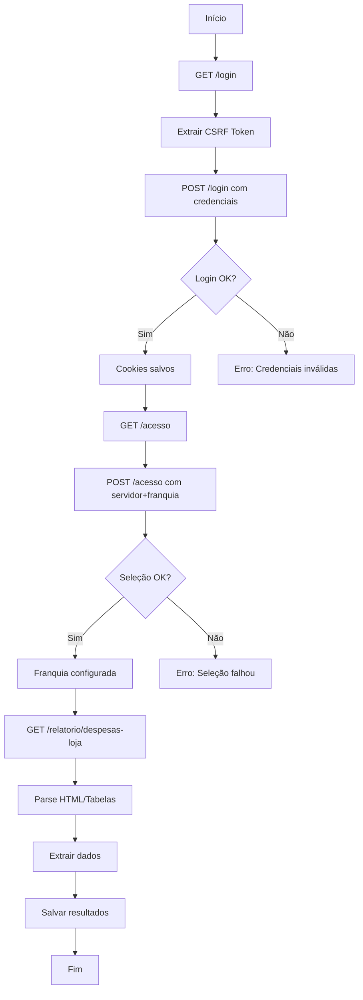

# Fluxo de Autenticação - Degustone

Documentação técnica do processo de autenticação e navegação no sistema Degustone.

## Visão Geral

O sistema Degustone segue um fluxo típico de aplicação web com autenticação baseada em sessão.

## Endpoints Principais

### 1. Login
- **URL:** `https://degustone.com.br/login`
- **Método:** GET (página), POST (autenticação)
- **Tipo:** Form-based authentication

#### Request (GET - Página de Login)
```http
GET /login HTTP/1.1
Host: degustone.com.br
User-Agent: Mozilla/5.0 (Windows NT 10.0; Win64; x64)
Accept: text/html
```

#### Request (POST - Autenticação)
```http
POST /login HTTP/1.1
Host: degustone.com.br
Content-Type: application/x-www-form-urlencoded

cpf=14549094710&password=161097
```

**Variações Possíveis de Campos:**
- `cpf` ou `username` ou `login`
- `password` ou `senha`
- `_token` (CSRF token, se presente)

#### Response (Sucesso)
- **Status:** 302 Redirect ou 200 OK
- **Headers:** Set-Cookie (sessão)
- **Redirect:** `/acesso` ou dashboard

---

### 2. Seleção de Servidor e Franquia
- **URL:** `https://degustone.com.br/acesso`
- **Método:** GET (página), POST (seleção)
- **Requisitos:** Cookie de sessão ativo

#### Request (GET - Página de Seleção)
```http
GET /acesso HTTP/1.1
Host: degustone.com.br
Cookie: PHPSESSID=xxx; laravel_session=yyy
```

#### Request (POST - Seleção)
```http
POST /acesso HTTP/1.1
Host: degustone.com.br
Cookie: PHPSESSID=xxx
Content-Type: application/x-www-form-urlencoded

servidor=1&franquia=1866
```

**Parâmetros:**
- `servidor`: ID do servidor (valor: 1)
- `franquia`: ID da franquia (valores possíveis: 1866, 2610, 3127)

---

### 3. Relatório de Despesas
- **URL:** `https://degustone.com.br/relatorio/despesas-loja`
- **Método:** GET
- **Requisitos:** Cookie de sessão + Franquia selecionada

#### Request
```http
GET /relatorio/despesas-loja HTTP/1.1
Host: degustone.com.br
Cookie: PHPSESSID=xxx; franquia_selected=1866
Accept: text/html
```

#### Response
```html
<!DOCTYPE html>
<html>
  <body>
    <table class="table">
      <thead>
        <tr>
          <th>Data</th>
          <th>Categoria</th>
          <th>Valor</th>
          ...
        </tr>
      </thead>
      <tbody>
        <tr>
          <td>2026-02-13</td>
          <td>Aluguel</td>
          <td>R$ 5.000,00</td>
          ...
        </tr>
      </tbody>
    </table>
  </body>
</html>
```

---

## Cookies e Sessão

### Cookies Importantes

1. **PHPSESSID** ou **laravel_session**
   - Cookie de sessão principal
   - Gerado no login
   - Validade: sessão ou timeout configurado
   - Essencial para todas as requisições autenticadas

2. **franquia_selected** (possível)
   - Armazena a franquia selecionada
   - Pode ser cookie ou sessão server-side

3. **XSRF-TOKEN** (se Laravel)
   - Token CSRF
   - Usado para proteção contra CSRF

### Gerenciamento de Sessão

```python
# Manter sessão entre requests
session = requests.Session()

# Login (cookies são salvos automaticamente)
session.post(login_url, data=credentials)

# Requisições subsequentes usam os mesmos cookies
session.get(relatorio_url)
```

---

## Tokens CSRF

### Detecção
```python
from bs4 import BeautifulSoup

soup = BeautifulSoup(html, 'html.parser')
csrf_token = soup.find('input', {'name': '_token'})
if csrf_token:
    token_value = csrf_token.get('value')
```

### Uso
```python
login_data = {
    'cpf': cpf,
    'password': senha,
    '_token': csrf_token  # Incluir no POST
}
```

---

## Seletores CSS Comuns

### Página de Login
```css
/* Campos de entrada */
input[name="cpf"]
input[type="text"]
input[placeholder*="CPF"]

input[name="password"]
input[type="password"]

/* Botão de submit */
button[type="submit"]
button:has-text("Entrar")
.btn-login
```

### Página de Seleção
```css
/* Servidor */
select[name="servidor"]
option[value="1"]

/* Franquia */
select[name="franquia"]
option[value="1866"]

/* Botão confirmar */
button:has-text("Confirmar")
button:has-text("Acessar")
```

### Página de Relatório
```css
/* Tabela principal */
table.table
table.report-table

/* Linhas e células */
table tbody tr
table tbody td
```

---

## Fluxo Completo



---

## Possíveis Desafios

### 1. JavaScript Dinâmico
Se a página usa muito JavaScript para carregar dados:
- **Solução:** Usar Playwright/Selenium (navegador real)
- **Alternativa:** Identificar chamadas AJAX e replicar

### 2. CAPTCHA
Se houver CAPTCHA no login:
- **Solução:** Usar serviços de resolução de CAPTCHA
- **Alternativa:** IP whitelisting (se disponível)

### 3. Rate Limiting
Se houver limite de requisições:
- **Solução:** Adicionar delays entre requests
- **Implementação:**
  ```python
  import time
  time.sleep(2)  # 2 segundos entre requests
  ```

### 4. Timeout de Sessão
Se sessão expira rapidamente:
- **Solução:** Fazer login antes de cada operação
- **Ou:** Manter sessão ativa com heartbeat

---

## Headers Recomendados

```python
headers = {
    'User-Agent': 'Mozilla/5.0 (Windows NT 10.0; Win64; x64) AppleWebKit/537.36',
    'Accept': 'text/html,application/xhtml+xml,application/xml',
    'Accept-Language': 'pt-BR,pt;q=0.9,en-US;q=0.8,en;q=0.7',
    'Accept-Encoding': 'gzip, deflate, br',
    'Connection': 'keep-alive',
    'Upgrade-Insecure-Requests': '1'
}
```

---

## Debugging

### Ver cookies atuais
```python
print(session.cookies.get_dict())
```

### Ver última URL
```python
print(response.url)
```

### Salvar HTML para inspeção
```python
with open('debug.html', 'w', encoding='utf-8') as f:
    f.write(response.text)
```

### Logs detalhados
```python
import logging
logging.basicConfig(level=logging.DEBUG)
```

---

## Checklist de Implementação

- [ ] Obter página de login e extrair CSRF
- [ ] Fazer POST com credenciais
- [ ] Verificar sucesso do login (redirect ou cookie)
- [ ] Navegar para página de seleção
- [ ] Selecionar servidor e franquia
- [ ] Confirmar seleção
- [ ] Acessar página de relatório
- [ ] Extrair dados (HTML parsing)
- [ ] Salvar resultados
- [ ] Tratar erros e timeouts
